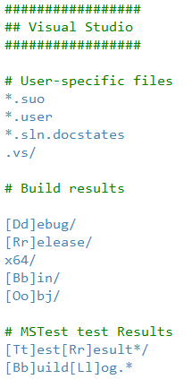
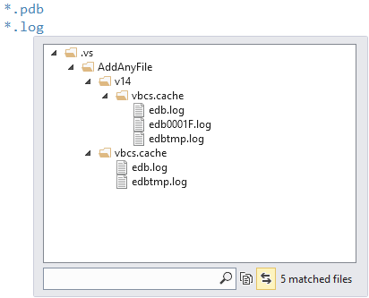
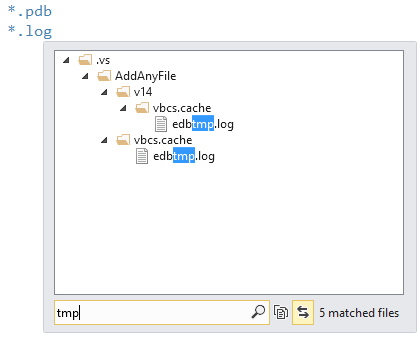
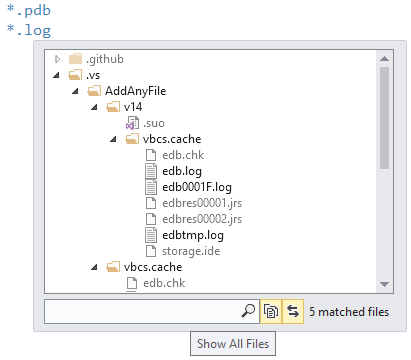
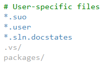
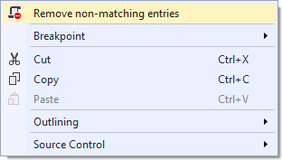
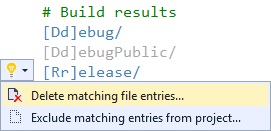
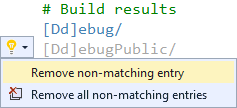
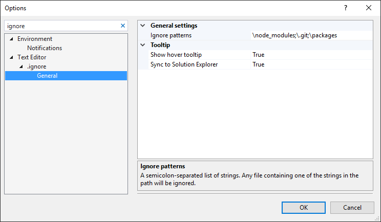

# .ignore

Download this extension from the [VS Gallery](https://visualstudiogallery.msdn.microsoft.com/d0eba56d-603b-45ab-a680-edfda585f7f3)
or get the [CI build](http://vsixgallery.com/extension/7ac24965-ea21-4108-9cac-6e46394aaaef/).

---------------------------------------

This extension supports *.gitignore (Git), .tfignore (Team Foundation),
.hgignore (Mercurial), .npmignore (npm), .dockerignore (Docker),
.chefignore (Chef), .cvsignore (CVS), .bzrignore (Bazaar),
.jshintignore (JSHint), .eslintignore (ESLint), .cfignore (Cloud Foundry),
.babelignore (Babel), .svnignore (SVN)*

See the [changelog](CHANGELOG.md) for changes and roadmap.

## Features

- Syntax highlighting
- File icons in Solution Explorer
- Non-matching file paths are grayed out
- Hover tooltips show path details
- Button to remove all non-matching paths
- Drag 'n drop support for files and folders
- Syntax validation
- Light Bulbs for quick actions

### Syntax highlighing
Syntax highlighting for all types of .ignore file.

### File icons
Correct file icons will be shown for all the .ignore files.

### Tooltip
Hovering over any path entry will give details about what
files the path points to.

To filter the results directly in the tooltip, simply place
the cursor in the bottom search field and start typing.

To synchronize the selected file in the tooltip with the
selected file in Solution Explorer, enable the 
*Suync with Selected Document* button:

Sometimes it can be helpful to see the matched files in context
of all the non-matched files. You can do that by toggling the
*Show All Files* button:

Double-clicking any file in the tooltip will open it up
in Visual Studio.

### Non-matches
If a file path doesn't point to a file or folder, then it
is being grayed out.

### Remove non-matches
Right-click in any .ignore file and select
*Remove non-matching entries*.

This action can be undone by invoking the *Undo* command
(ctrl-z).

### Drag 'n drop
You can drag any file or folder from Solution Explorer or
from the file system using Windows Explorer. This will add
the correct relative path to the .ignore file.

### Validation
Validation helps you avoid typos and other mistakes. For
instance, it will catch the user of **../** which is not
allowed in .ignore files.

### Light Bulbs
Light bulbs appear in the margin to give you quick access
to perform helpful actions.

#### For matches:

**Delete matching file entries...** will delete the matching
files and folders from disk. If any of the files are part
of a project in the solution, the project will be updated
to reflect the deletion of the files.

**Exclude matching entries from project...** will not delete
the files and folder from disk, it will only remove any
reference to them from the project.

#### For non-matches:

**Remove non-matching entry** will delete the current
line from the .ignore file. This action can be undone by
invoking the *Undo* command (ctrl-z).

**Remove all non-matching entry** will delete all non-matching
entries in the .ignore file. It does the same as the right-click
command does. This action can be undone by invoking the
*Undo* command (ctrl-z).

## Settings
Various settings are available in the **Tools -> Options**
dialog. You can find them under **Text Editor/.ignore**
in the list.

## Contribute
Check out the [contribution guidelines](CONTRIBUTING.md)
if you want to contribute to this project.

For cloning and building this project yourself, make sure
to install the
[Extensibility Tools 2015](https://visualstudiogallery.msdn.microsoft.com/ab39a092-1343-46e2-b0f1-6a3f91155aa6)
extension for Visual Studio which enables some features
used by this project.

## License
[Apache 2.0](LICENSE)
